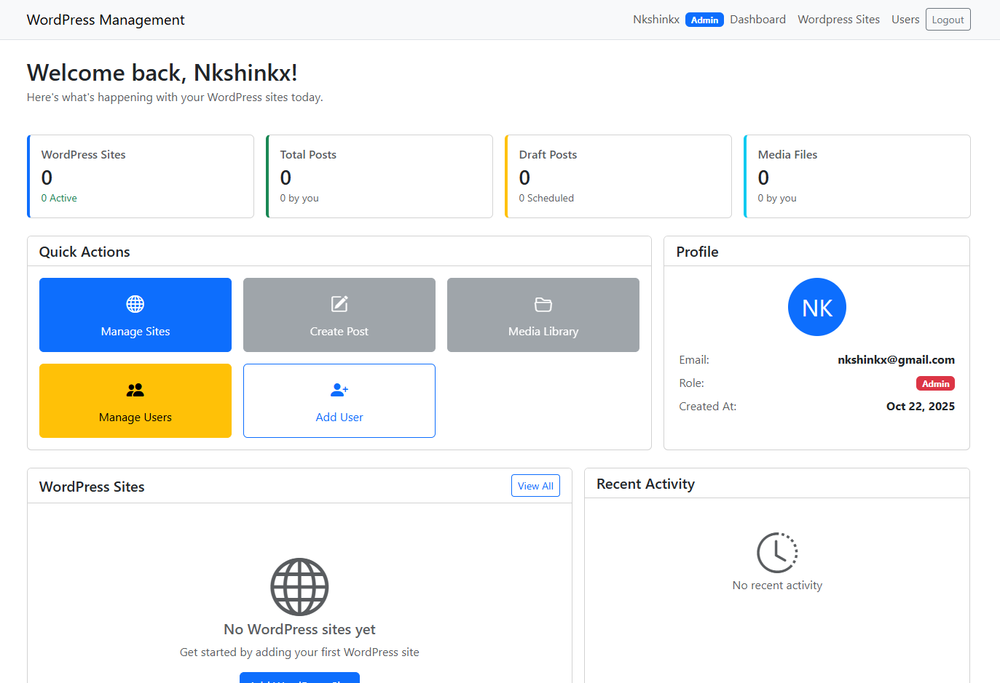

# WordPress Management System

A Laravel-based centralized management system for managing multiple WordPress sites through the WordPress REST API. This application allows you to create, edit, schedule, and publish posts across multiple WordPress installations from a single place.

## Overview

This project was created after discovering the powerful WordPress REST API capabilities. By leveraging the JWT Authentication plugin, this system provides a unified interface to manage content across multiple WordPress sites without needing to log into each one individually.



## Features

### Site Management
- Connect and manage multiple WordPress sites from one dashboard
- Real-time connection status monitoring
- JWT token auto-refresh mechanism
- Test connection functionality to verify site accessibility

### Post Management
- Create and edit posts locally before pushing to WordPress
- Push posts to WordPress as drafts
- Publish posts directly to WordPress
- Schedule posts for future publishing
- Sync existing posts from WordPress sites
- Track post history and changes
- Support for categories and tags
- Featured image support
- Post status tracking (local draft, pushed draft, published, out of sync)

### Media Management
- Upload media files to WordPress sites
- Sync existing media from WordPress
- Media library browsing per site
- Support for images, PDFs, and documents

### Category & Tag Management
- Sync categories and tags from WordPress sites
- Create new categories and tags
- Automatic synchronization support

### User Management
- Role-based access control (Admin, Manager, User)
- Admin: Full system access including user and site management
- Manager: Can manage sites and posts
- User: Can create and manage posts only

### Sync & History
- Complete data synchronization (posts, media, categories, tags)
- Post history tracking with user attribution
- Last sync timestamp tracking
- Error logging and reporting

## Requirements

- PHP 8.2 or higher
- Composer
- MySQL/MariaDB or SQLite
- Laravel 12.x
- WordPress sites with REST API enabled
- JWT Authentication for WP REST API plugin installed on WordPress sites

## WordPress Prerequisites

Each WordPress site you want to manage must have:

1. **JWT Authentication for WP REST API Plugin**
   - Install and activate the plugin
   - Configure `wp-config.php` with JWT secret key:
   ```php
   define('JWT_AUTH_SECRET_KEY', 'your-secret-key-here');
   define('JWT_AUTH_CORS_ENABLE', true);
   ```

2. **REST API Enabled** (enabled by default in modern WordPress)

3. **User Account** with appropriate permissions (Editor or Administrator role)

## Installation

### 1. Clone the Repository
```bash
git clone git@github.com:nkshinkx/wordpressMgmt.git
cd wordpressMgmt
```

### 2. Install Dependencies
```bash
composer install
```

### 3. Environment Configuration
```bash
cp .env.example .env
```

Edit `.env` file and configure your database:
```env
DB_CONNECTION=mysql
DB_HOST=127.0.0.1
DB_PORT=3306
DB_DATABASE=wordpress_management
DB_USERNAME=your_db_username
DB_PASSWORD=your_db_password
```

### 4. Generate Application Key
```bash
php artisan key:generate
```

### 5. Run Migrations 
```bash
php artisan migrate
```

### 6. Seed Database (Optional)
```bash
php artisan db:seed
```

This will create a default admin user:
- Email: admin@example.com
- Password: password
- Can also just run php artisan migrate:fresh --seed 

### 7. Start Development Server
```bash
php artisan serve
```

Visit `http://127.0.0.1:8000` to access the application.

## Usage

### Adding a WordPress Site

1. Log in to the management system
2. Navigate to "WordPress Sites"
3. Click "Add New Site"
4. Fill in the details:
   - **Site Name**: Friendly name for the site
   - **Domain**: Full URL (e.g., https://example.com)
   - **REST Path**: Usually `/wp-json/wp/v2/` (default)
   - **Username**: WordPress username
   - **Password**: WordPress application password or user password
   - **Auto Refresh**: Enable automatic token refresh (cron refreshes token every 12 hours) 
5. Click "Save" - the system will test the connection automatically

### Creating and Publishing Posts

1. Select a WordPress site from the dashboard
2. Click "Create New Post"
3. Fill in post details:
   - Title
   - Content
   - Excerpt (optional)
   - Categories
   - Tags
   - Featured image
4. Click "Save Draft" to save locally
5. Click "Push to WordPress" to send the post as a draft
6. Click "Publish" to make the post live on WordPress

### Syncing Data

To sync existing content from a WordPress site:
1. Go to the site details page
2. Click "Sync All Data"
3. The system will fetch:
   - Existing posts
   - Media files
   - Categories
   - Tags

## API Endpoints

The application provides internal API endpoints for AJAX operations:

### WordPress Sites
- `GET /wordpress-sites-list` - List all sites
- `POST /wordpress-sites` - Create new site
- `PUT /wordpress-sites/{id}` - Update site
- `DELETE /wordpress-sites/{id}` - Delete site
- `POST /test-wordpress-connection` - Test Wordpress REST API

### Posts
- `GET /api/wordpress-posts/{siteId}` - Get posts for a site
- `GET /api/wordpress-post/{id}` - Get single post
- `POST /api/wordpress-posts` - Create post
- `PUT /api/wordpress-posts/{id}` - Update post
- `POST /api/wordpress-posts/{id}/push` - Push to WordPress
- `POST /api/wordpress-posts/{id}/publish` - Publish post
- `DELETE /api/wordpress-posts/{id}` - Delete post

### Media
- `POST /api/wordpress-media` - Upload media
- `GET /api/wordpress-media/{siteId}` - Get media files

### Categories & Tags
- `POST /api/wordpress-categories/{siteId}/sync` - Sync categories
- `GET /api/wordpress-categories/{siteId}` - Get categories
- `POST /api/wordpress-tags/{siteId}/sync` - Sync tags
- `GET /api/wordpress-tags/{siteId}` - Get tags

### Sync
- `POST /api/wordpress-data/{siteId}/sync` - Sync all data

## Database Schema

### Main Tables

**wp_sites** - WordPress site configurations
- id, site_name, domain, rest_path
- username, password (encrypted)
- jwt_token, jwt_expires_at
- status, connection_error, last_connected_at

**wp_posts** - Post content and metadata
- id, wp_site_id, user_id
- title, content, excerpt
- featured_image_id, wp_post_id
- status, wp_status
- categories, tags (JSON)
- scheduled_at, last_synced_at

**wp_media** - Media files
- id, wp_site_id, user_id
- original_filename, local_path
- wp_media_id, wp_url
- upload_status, file_size, mime_type

**wp_categories** - Category mappings
- id, wp_site_id, wp_category_id
- name, slug, parent_id

**wp_tags** - Tag mappings
- id, wp_site_id, wp_tag_id
- name, slug

**wp_post_history** - Post change history
- id, wp_post_id, user_id
- action, notes, created_at

**users** - System users
- id, name, email, password
- role (admin, manager, user)


## Troubleshooting

### Connection Failed
- Verify WordPress site is accessible
- Check if JWT plugin is installed and configured
- Verify username and password are correct
- Check if `JWT_AUTH_SECRET_KEY` is defined in wp-config.php

### Token Validation Failed
- Regenerate the JWT secret key in WordPress
- Clear tokens in the management system
- Test connection again

### Posts Not Syncing
- Check WordPress user has appropriate permissions
- Verify REST API is not disabled
- Check for plugin conflicts on WordPress site

### Media Upload Failed
- Verify file size limits in PHP and WordPress
- Check storage directory permissions
- Ensure media endpoint is accessible


### Logging
Application logs are stored in `storage/logs/laravel.log`

## Tech Stack

- **Backend**: Laravel 12.x
- **Database**: MySQL
- **Authentication**: Laravel built-in auth
- **API Client**: cURL (native PHP)
- **Frontend**: Blade templates (included views)
- **WordPress Integration**: WordPress REST API v2 + JWT Authentication Plugin

## Project Structure

```
├── app/
│   ├── Http/
│   │   ├── Controllers/
│   │   │   ├── WordpressController.php    # Main WordPress operations
│   │   │   ├── UserController.php         # User management
│   │   │   ├── DashboardController.php    # Dashboard
│   │   │   └── Auth/LoginController.php   # Authentication
│   │   └── Middleware/                    # Custom middleware
│   ├── Models/
│   │   ├── WpSites.php                    # WordPress sites
│   │   ├── WpPost.php                     # Posts
│   │   ├── WpMedia.php                    # Media files
│   │   ├── WpCategory.php                 # Categories
│   │   ├── WpTag.php                      # Tags
│   │   ├── WpPostHistory.php              # History tracking
│   │   └── User.php                       # Users
│   └── Services/
│       └── WordpressPostService.php       # WordPress API service
├── database/
│   └── migrations/                         # Database migrations
├── resources/
│   └── views/                              # Blade templates
├── routes/
│   └── web.php                             # Application routes
└── storage/                                # File uploads and logs
```

## Contributing

Contributions are welcome! Please feel free to submit a Pull Request.

## License

This project is open-source software licensed under the MIT License.

## Acknowledgments

- Built with Laravel Framework
- Utilizes WordPress REST API
- JWT Authentication for WP REST API plugin

## Support

For issues, questions, or contributions, please open an issue on the GitHub repository.

---

**Note**: This is a learning project created to explore WordPress REST API capabilities. Use in production environments at your own discretion and ensure proper security measures are in place.

